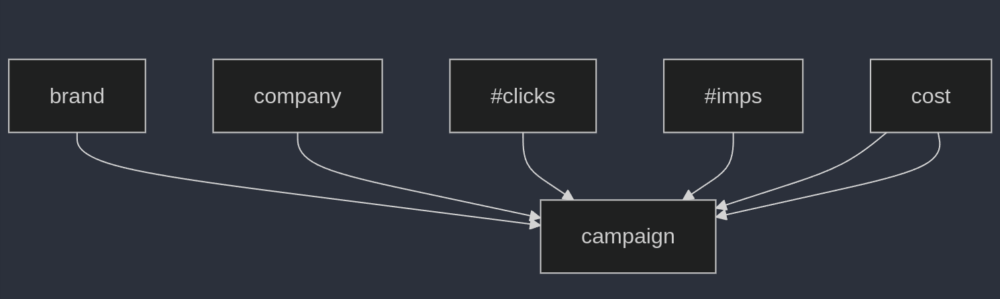

# Build a Question/Answering system over SQL data

## Overview

The basic ways to create a Q&A chain and agent over a SQL database. These systems will allow us to ask a question about the data in a SQL database and get back a natural language answer. Agents can query the database in a loop as many time as it needs to answer the question.

## Data

We will use a dataset of a real-world database.
- File: `tables.txt` describe the tables of the database.
- File: `examples.txt` contains examples questions -> query -> answer[optional].

## Evaluation

We will use the following metrics to evaluate the performance of the system:
- File: `evaluation.txt` contains the evaluation results.
- This list of examples will be used to test the system.
- This list will be updated as we add more examples.

## Architecture:

At a high-level, the steps of most SQL chain and agent are:
- Convert question to SQL query: Model converts user input to a SQL query.
- Execute SQL query: Execute the SQL query
- Answer the question: Model responds to user input using the query results.

## Scope:

A db only cover a finite set of questions.
The more questions we ask, the more sample we have.
The more sample we have, the more accurate the model is.

When we have most common questions, our system will be able to answer 99% of questions precisely.

## Development cycle:

1. Create tables description:
   - Analyze the database schema
   - Document table structures, relationships, and key fields
   - Store this information in `tables.txt`

2. Generate example questions:
   - Brainstorm relevant questions based on the database content
   - Ensure a diverse range of query types and complexity
   - Add these questions to `examples.txt`

3. Develop SQL queries:
   - For each example question, create an appropriate SQL query
   - Ensure queries are efficient and accurate
   - Add these queries to `examples.txt`, paired with their respective questions

4. Implement / deploy the Q&A system:
   - Develop the natural language processing component
   - Create the SQL query generation module
   - Implement the database interaction layer
   - Build the response generation component

5. Collect questions:
   - Use example questions to test the system
   - Analyze performance and accuracy
   - Refine the system based on test results

6. Expand and iterate:
   - Continuously add new example questions and queries
   - Update `tables.txt` as the database schema evolves
   - Regularly retrain and improve the Q&A model

This development cycle ensures a systematic approach to building and improving the Q&A system over SQL data, with a focus on comprehensive documentation and continuous refinement.

flowchart TD
    A[Create tables description] --> |Collect common queries| B[Generate example questions]
    B --> C[Develop SQL queries]
    C --> |Provide many examples| D[Implement / deploy the Q&A system]
    D --> E[Collect questions]
    E --> |Add more question, query examples| B

## Warning:

- Query can be very big, that can cause out of memory error.
- Query can be wrong.
